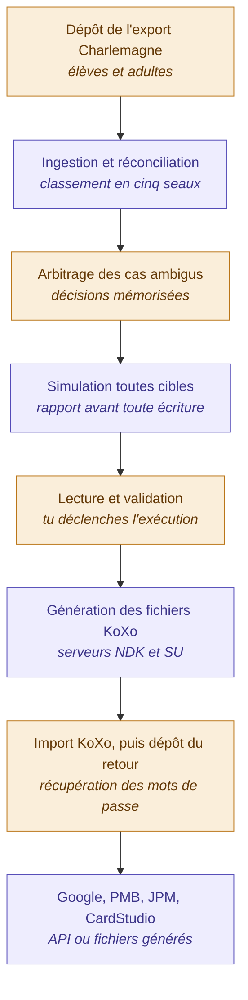

# Fonctionnement du programme de préparation de rentrée

**Ensemble Scolaire du Kreisker**
Document opérationnel — déroulé des traitements, étape par étape et module par module

> Document complémentaire de *Gestion de la rentrée — logique de fonctionnement*,
> qui décrit le raisonnement métier. Celui-ci décrit **le déroulé concret** :
> qui fait quoi, dans quel ordre, et ce que produit chaque module.

---

## 1. Principe général

Le programme repose sur trois règles de comportement, valables partout :

1. **Rien n'est écrit sans validation explicite.** Tout traitement produit
   d'abord un rapport de simulation. L'exécution réelle est une action distincte.
2. **Chaque module produit toujours un fichier d'import**, au format exact
   attendu par sa cible. L'API n'est qu'un mode d'envoi supplémentaire, proposé
   pour Google uniquement — le fichier reste disponible en permanence.
3. **Le programme refuse plutôt que de deviner.** Classe inconnue, cas ambigu,
   dépendance non satisfaite : il s'arrête et explique, il n'improvise pas.

---

## 2. Le cycle en un coup d'œil



Version texte du même enchaînement :

```
   [TOI]      1. Dépôt de l'export Charlemagne (élèves + adultes)
                        │
   [PROG]     2. Ingestion et réconciliation → cinq seaux
                        │
   [TOI]      3. Arbitrage des cas ambigus
                        │
   [PROG]     4. Simulation, toutes cibles confondues
                        │
   [TOI]      5. Lecture du rapport et validation
                        │
   [PROG]     6. Génération des fichiers KoXo (NDK et SU)
                        │
   [TOI]      7. Import dans KoXo, puis dépôt du fichier de retour
                        │
   [PROG]     8. Google, PMB, JPM, CardStudio
```

---

## 3. Phase 0 — Configuration

*Une seule fois, puis maintenance légère à chaque rentrée.*

### Ce que tu fais

Tu importes la table de correspondance — la feuille `Table` du classeur actuel.
Elle contient, ligne par ligne :

| Champ | Exemple |
|---|---|
| Site | `NDE` |
| Classe Charlemagne | `TROISIEME FUSHIA` |
| Code court | `3F` |
| Groupe Google | `3eme-fuschia@ndecleder.fr` |
| Unité d'organisation pré-rentrée | `/2. NDE/NDE2026` |
| Unité d'organisation définitive | `/2. NDE/NDE2026/3F` |

Tu règles ensuite les paramètres généraux :

- domaine de messagerie ;
- forme du login et règles de normalisation ;
- délai de purge Google (18 mois) ;
- chemin UNC des photos ;
- serveurs KoXo par site ;
- groupes d'accès JPM par régime et statut d'internat.

### Ce que le programme fait

Rien d'automatique. C'est de la configuration pure, éditable à tout moment
depuis son onglet.

### Maintenance annuelle

Ajouter ou retirer les classes qui changent. Le programme signale toute classe
présente dans Charlemagne et absente de la table : **c'est un cas bloquant**. Il
refuse de traiter les élèves concernés plutôt que de les affecter arbitrairement.

---

## 4. Phase 1 — Amorçage

*Une seule fois, à la mise en service. Ne sera jamais refaite.*

C'est la seule étape réellement lourde du projet.

### Ce que tu fais

Tu déposes quatre jeux de fichiers :

1. export Charlemagne élèves ;
2. export Charlemagne adultes ;
3. export Google Workspace complet — tous les comptes, toutes les unités
   d'organisation ;
4. exports KoXo « tous » des deux serveurs, NDK et SU.

### Ce que le programme fait

Il crée une fiche `Personne` pour chaque ligne Charlemagne, avec sa clé
(`E5292`, `A60`), son badge, son login et son adresse mail.

Puis il tente de rattacher chaque compte Google et chaque compte KoXo existant à
l'une de ces personnes, en s'appuyant sur l'adresse mail et le login — les seules
informations disponibles à ce stade.

Il te présente enfin un écran de qualification contenant **uniquement ce qu'il
n'a pas su rattacher seul**.

### L'écran de qualification

Pour chaque compte non rattaché, tu choisis une catégorie :

| Décision | Effet |
|---|---|
| Personne réelle | Rattachement à une fiche du référentiel |
| Compte fantôme | Marqué pour purge |
| Compte de service | Sorti du périmètre, plus jamais proposé |
| Doublon | Fusion avec la fiche principale |

**Chaque décision est enregistrée définitivement.** C'est ce qui garantit que ce
travail ne sera pas à refaire.

### Résultat

Le référentiel existe.

Le programme génère alors un fichier de mise à jour Google à deux colonnes
seulement — adresse mail et `Employee ID`. Tu l'importes, ou tu le pousses par
API.

**À partir de cet instant, la clé pivot est présente sur les cinq cibles, et
plus aucun rapprochement ne se fait sur le nom.**

---

## 5. Phase 2 — Le cycle de traitement

*À chaque rentrée, puis à intervalle régulier pendant l'année. Le déroulé est
identique dans les deux cas.*

### Étape 1 — Dépôt de l'export Charlemagne

**Toi.** Deux fichiers, élèves et adultes, par glisser-déposer dans l'onglet
correspondant.

### Étape 2 — Ingestion

**Le programme.** Il lit, normalise et valide.

La normalisation traite : accents, casse, particules, apostrophes, traits
d'union doubles, espaces multiples.

Il produit un rapport d'ingestion :

- nombre de lignes lues ;
- lignes rejetées, avec le motif ;
- classes inconnues de la table de correspondance ;
- adresses mail manquantes ;
- doublons internes au fichier.

L'ingestion est enregistrée comme un `Snapshot` daté. **Elle ne modifie encore
rien.**

### Étape 3 — Réconciliation

**Le programme.** Il compare le snapshot au référentiel, sur la clé pivot, et
remplit les cinq seaux :

```
Nouveaux            187
Identiques        1 402
Modifiés            214
Sortants            163
Ambigus               6
```

Chaque seau est cliquable et détaillé personne par personne, avec le motif du
classement.

Pour un « modifié », le changement est explicite :

```
DUPONT Pierre     classe   3F → 4J
MARTIN Léa        site     NDE → NDK
BERNARD Tom       nom      MARTIN → MARTIN-LE GALL
```

### Étape 4 — Arbitrage

**Toi.** Seuls les cas ambigus demandent une intervention, ainsi que les
éventuelles collisions de login parmi les nouveaux.

- **Cas ambigu** : le programme affiche les deux candidats côte à côte. Tu
  tranches — même personne, ou personnes différentes.
- **Collision de login** : le programme propose un suffixe de désambiguïsation.
  Tu valides ou tu modifies.

**Ces décisions sont mémorisées et ne seront pas redemandées l'année suivante.**

### Étape 5 — Attribution

**Le programme.** Pour chaque nouveau : login normalisé, suffixe si nécessaire,
adresse mail, unité d'organisation, groupes, badge.

Tout est créé à l'état **prévu**. Rien n'existe encore dans aucun système.

C'est le moment où l'ensemble de la rentrée peut être vérifié tranquillement, en
juillet, avant qu'un seul compte soit créé.

### Étape 6 — Simulation

**Le programme.** Un rapport unique, toutes cibles confondues :

```
KoXo NDK      112 créations,  0 suppressions
KoXo SU        75 créations,  0 suppressions
Google        187 créations, 214 déplacements d'unité,
              163 mises en quarantaine, 41 purges échues
PMB           187 créations, 163 suppressions
JPM           187 ajouts (a), 163 suppressions (b), 214 modifications (m)
CardStudio  1 789 lignes, 12 photos orphelines
```

### Étape 7 — Validation

**Toi.** Point de non-retour. Tant que tu n'as pas validé, rien n'est écrit.

Le rapport est exportable, relisible, comparable à celui de l'année précédente.
Un chiffre aberrant — 400 sortants au lieu de 160 — permet de s'arrêter avant
tout dégât.

### Étape 8 — Exécution

**Le programme, module par module.** Voir la section suivante.

---

## 6. Détail des modules

Chaque module dispose de son onglet et fonctionne de la même manière : un bouton
qui génère, un fichier qui sort, une consigne qui indique quoi en faire.

### 6.1 Module KoXo

**Génère** trois fichiers CSV séparés par virgules, aux colonnes exactes de
KoXo :

- élèves NDK
- élèves SU
- adultes NDK + SU

Colonnes produites : `Groupe primaire` (le login), `Groupe secondaire`, `Titre`,
`Nom`, `Prénom`, `ID unique` (le badge), `Date de naissance`, `Email`.

**Le champ mot de passe est laissé vide** — c'est KoXo qui le remplit.

**Ce que tu fais :**

1. Dans KoXo, sur le groupe secondaire concerné, tu synchronises avec le fichier.
2. Tu exportes depuis KoXo le fichier « Nouveaux ».
3. Tu déposes ce fichier dans le programme.

**Ce que le programme fait au retour :** il lit les mots de passe générés, les
associe aux personnes via le badge, passe leurs comptes KoXo à l'état `créé`, et
**arme le module Google**.

> Tant que ce retour n'a pas eu lieu, l'onglet Google **refuse** de créer les
> nouveaux comptes et affiche la raison. La contrainte d'ordre devient un
> garde-fou explicite au lieu d'une règle à mémoriser.

### 6.2 Module Google Workspace

**Deux modes, au choix, pour chaque opération.**

**Mode fichier** — le programme génère les CSV au format Google :

- créations ;
- mises à jour d'unité d'organisation ;
- adhésions et retraits de groupes ;
- mises en quarantaine.

Tu les importes depuis la console d'administration.

**Mode API** — le programme réalise les mêmes opérations directement :
créations avec le mot de passe issu de KoXo, déplacements d'unité, gestion des
groupes, renseignement de l'`Employee ID`, suspensions.

**Garde-fous côté API :**

- simulation obligatoire avant chaque exécution réelle ;
- reprise possible après interruption — le programme sait ce qui a déjà été
  fait ;
- **aucune suppression directe** : une suppression n'est proposée que pour les
  comptes dont la date de purge est échue, et avec une confirmation séparée.

**Ce que le programme ne fait jamais :** supprimer un compte le jour du départ.
Le sortant passe en quarantaine, avec une date de purge calculée à +18 mois.

### 6.3 Module PMB

**Génère** un CSV séparé par points-virgules par site, au format lecteurs de
PMB, avec les créations et la liste des suppressions.

**Ce que tu fais :** import dans l'interface d'administration de chaque instance
PMB.

**Réserve :** la clé de rapprochement utilisée par PMB n'est pas encore
déterminée. Le module est écrit pour utiliser le badge, avec une option INE
activable dès vérification. C'est le seul point volontairement laissé
paramétrable faute d'information.

### 6.4 Module JPM / SmartAir

**Génère** un fichier différentiel avec la colonne `Op` renseignée :

| Valeur | Signification |
|---|---|
| `a` | Ajout — nouveaux |
| `b` | Suppression — sortants |
| `m` | Modification — changements de groupe ou de classe |

Colonnes produites : `Op`, `Id`, `Name`, `CardId`, `Group`, dates d'activation
et d'expiration.

Les groupes d'accès sont déduits du régime et du statut d'internat, via la table
de correspondance.

**Ce que tu fais, la première année :** tu génères, tu lis, **et tu n'importes
pas immédiatement**. Tu compares le fichier à ce que tu aurais produit
manuellement. Quand les deux concordent, tu importes.

> Ce module affiche un bandeau d'avertissement tant qu'il n'a pas été marqué
> comme validé. Ce traitement n'a jamais été exécuté dans l'établissement.

### 6.5 Module CardStudio

**Génère** le fichier au format `BadgesESK` : `Num Badge`, codes établissement
et classe, régime, nom, prénom, chemin de photo, chambre.

**Deux traitements spécifiques :**

1. **Déduplication** — une ligne par personne, contrairement au fichier actuel
   où les internes apparaissent deux fois (1 749 lignes pour 1 672 badges).
2. **Contrôle des photos** — pour chaque personne, le programme vérifie que le
   fichier photo existe réellement à l'emplacement UNC attendu, et produit la
   liste des orphelines avec le motif probable : changement de nom, accent,
   trait d'union.

**Ce que tu fais :** tu corriges les photos orphelines, puis tu déposes le
fichier sur le poste du secrétariat.

### 6.6 Module suivi et purge

**Ce que le programme fait en permanence :** il surveille les comptes en
quarantaine et affiche ceux dont la date de purge arrive à échéance.

**Ce que tu fais :** une fois par trimestre, tu ouvres cet onglet — *« 41 comptes
Google arrivés à échéance »* — tu vérifies et tu valides la purge.

C'est la seule tâche récurrente hors rentrée. Elle prend quelques minutes.

---

## 7. Récapitulatif — ce que tu fais réellement

Sur un cycle complet, ton intervention se limite à cinq gestes :

1. Déposer les deux fichiers Charlemagne.
2. Arbitrer une poignée de cas ambigus.
3. Lire le rapport de simulation et valider.
4. Faire l'aller-retour KoXo : importer, exporter, redéposer.
5. Récupérer le fichier de chaque module cible — ou laisser l'API faire pour
   Google.

Tout le reste est automatique : normalisation, rapprochement, détection
d'homonymes, calcul des logins, formatage des cinq fichiers, gestion des
quarantaines, contrôle des photos.

Et tout est simulé avant d'être appliqué.

---

## 8. Comportements transverses

| Comportement | Règle |
|---|---|
| Simulation | Systématique, avant toute écriture, sur tous les modules |
| Idempotence | Rejouer un traitement produit le même résultat |
| Journalisation | Chaque traitement tracé : quoi, quand, sur qui, résultat |
| Reprise | Un traitement interrompu reprend où il s'est arrêté |
| Blocage sur inconnue | Classe absente de la table, dépendance non satisfaite : arrêt et explication |
| Mots de passe | Jamais stockés — transportés le temps du traitement, puis oubliés |
| Suppressions | Jamais immédiates sur Google ; échéance et confirmation séparée |
| Décisions humaines | Mémorisées définitivement, jamais redemandées |
